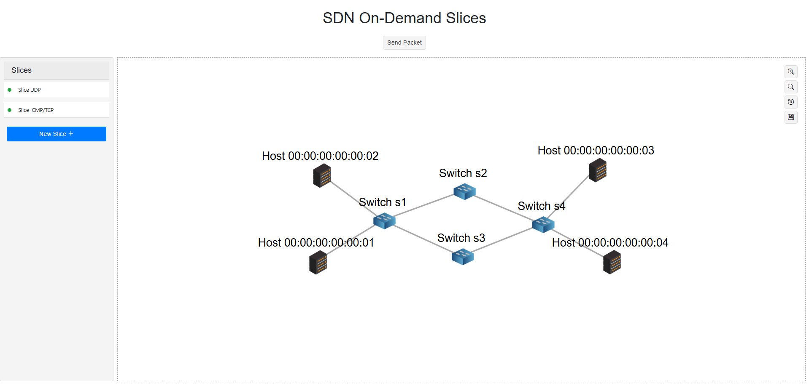
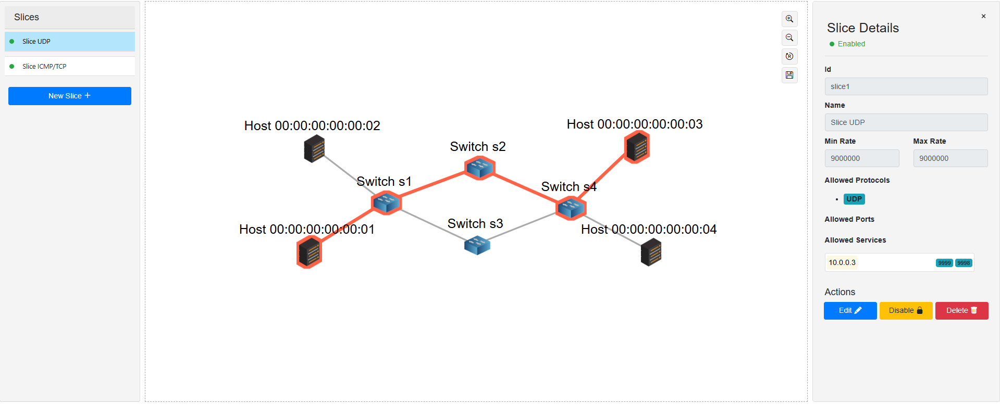
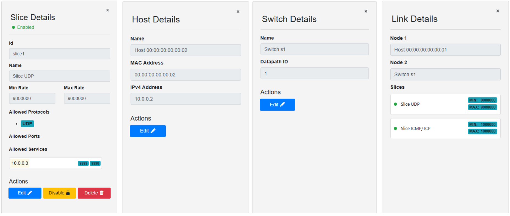
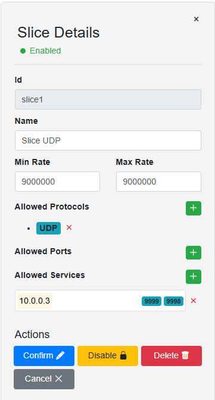
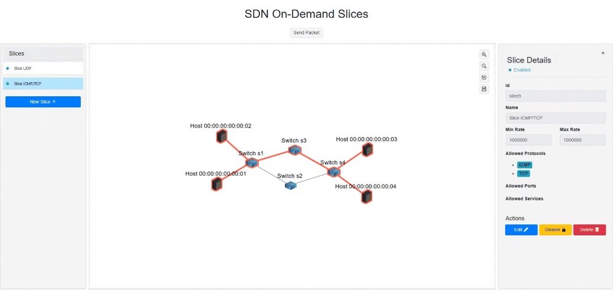
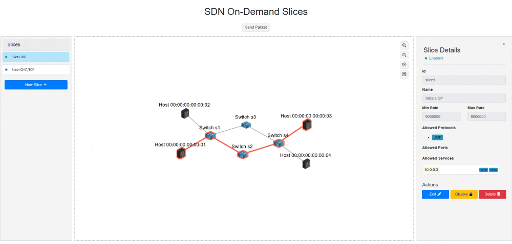
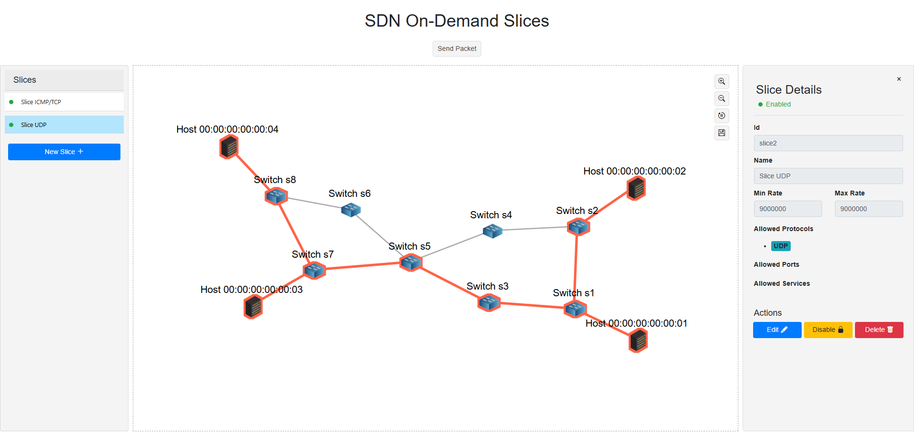

# sdn-on-demand-slices
SDN On-demand dynamic slicing software using comnetsemu.

This project is realized for the Networking 2 Master course of University of Trento and was developed through the combined effort of: [Simone Brentan](https://github.com/sbrentan), [Matteo Costalonga](https://github.com/wamuumu), [Alex Reichert](https://github.com/Faerye0)

# Document index

- [Project setup](#project-setup)
    - [Comnetsemu installation](#comnetsemu-installation)
    - [Project installation](#project-installation)
    - [Launcher errors](#launcher-errors)
- [Running the project](#running-the-project)
- [Application GUI](#application-gui)
    - [Details Menus](#details-menus)
    - [Slice Rules](#slice-rules)
    - [Editing a slice](#editing-a-slice)
    - [Adding a new slice](#adding-a-new-slice)
    - [Sending a packet](#sending-a-packet)
    - [How does packet tracing works?](#how-does-packet-tracing-works)
- [Other network topologies](#other-network-topologies)
    - [Network 2](#network-2)
- [Custom terminal commands](#custom-terminal-commands)
- [Package structure](#package-structure)
- [General mininet and terminal commands](#general-mininet-and-terminal-commands)
    - [Mininet terminal](#mininet-terminal)
    - [Mininet window commands](#mininet-window-commands)
- [Useful references](#useful-references)


# Project setup

This section will go through the steps to set up the project on your local machine.

To run this project locally, you need to have a simulation environment set up where to run Mininet and Ryu controller. We used **ComnetSemu** as our network simulation environment.

ComnetSemu is a virtual machine that runs on VirtualBox and provides a pre-configured environment for network simulations.

## Comnetsemu installation

This project installation and setup has been tested only within a `Windows` environment.

Before starting, make sure you have VirtualBox and Vagrant installed on your machine.
* You can download **Virtualbox** from its offcial [website](https://www.virtualbox.org/).
* You can download **Vagrant** from its official [website](https://www.vagrantup.com/).

To run the virtual machine with ComnetSemu, you can go to this [github repository](https://github.com/stevelorenz/comnetsemu) and clone it to your local machine.
```sh
git clone https://github.com/stevelorenz/comnetsemu
```

After cloning the repository, you need to setup and build the virtual machine with Vagrant.

Open the Vagrantfile in the cloned repository and add this following line in the correct section.
```vagrantfile
comnetsemu.vm.network "forwarded_port", guest: 8080, host: 8080
```
This is used to forward the port 8080 to the host machine and make the web interface of ComnetSemu accessible from your browser.

Additionally, we suggest to add this line in the Vagrantfile to increase the boot timeout, as the virtual machine takes a while to boot up:
```vagrantfile
config.vm.boot_timeout = 3600
```
You can add this line at around line 102, after the `config.vm.provider "virtualbox"` section. This will increase the boot timeout to 1 hour, which should be enough for the virtual machine to start up.

After modifying the Vagrantfile, you can start the virtual machine by running the following command in the terminal inside the cloned repository:
```sh
vagrant up
```

This will download the necessary files and start the virtual machine. It may take a while, so be patient.

> **Note**: After running the `vagrant up` command the terminal may hang for a while and sometimes it freezes. It can be useful to open the VirtualBox application manually (just opening the application should be enough) to unfreeze the terminal.

## Project installation

After the virtual machine is up and running, you can access it via SSH with the following command:
```sh
vagrant ssh
```

Once you are inside the virtual machine, go inside the `app` folder in the `comnetsemu` directory:
```sh
cd comnetsemu/app
```

Now you can clone this repository inside the `app` folder:
```sh
git clone https://github.com/sbrentan/sdn-on-demand-slices.git
```

Install mininet and the openvswitch package for `superuser`:
```sh
sudo apt update
sudo apt install openvswitch-switch
sudo apt install mininet
```

After cloning the repository, go inside the cloned directory and install the necessary dependencies:
```sh
sudo pip install -r requirements.txt
```

Finally, you can start the application by running the apposite launcher script:
```sh
./launcher.sh
```

## Launcher errors

If, when running the launcher script, you get an error like this:
```bash
$ ./launcher.sh
-bash: ./launcher.sh: /bin/bash^M: bad interpreter: No such file or directory
```
 
It means you need to fix the end of line characters in the `launcher.sh` file from `CLRF` to `LF`. This can be done with the following command:
```sh
sed -i 's/\r$//' launcher.sh
```

Instead, if you get an error like this:
```bash
$ ./launcher.sh
Error: --net argument is required. Possible values are: 1, 2, 3.
```

This is correct and expected behavior, as the launcher script requires a network configuration to be specified in order to run the application.

This argument is used to specify the network configuration to apply using `Mininet`. See the following section for more details.


# Running the project

Three different demo scenarios have been implemented in this project, each with its own network configuration. You can run them by passing the `--net` argument to the launcher script, where the possible values are `1`, `2` or `3`. For example:
```sh
./launcher.sh --net 1
```

This will start the application with the first network configuration, which is a simple topology with 4 hosts and 4 switches.

The output of the command will be something like this:
```bash
vagrant@comnetsemu:~/comnetsemu/app/sdn-on-demand-slices$ ./launcher.sh --net 1
Starting Ryu controller...
Starting Mininet network...

Waiting for all nodes to be correctly set up and available...
Attempt 2/5...
All nodes are ready.

Polling APIs for packets requests...
mininet>
```

After starting the application, what basically happens is the following:
* The Ryu controller is started, which is responsible for managing the network and handling the OpenFlow messages.
* Mininet is started and the network is created with the specified configuration, which creates the virtual hosts and switches.
* The controller waits for all nodes to be correctly set up and available, which may take a few seconds. To do this, it tries to ping all hosts in the network until they are reachable.
    * This takes a while because the network becomes available only after all the nodes/switches are connected and the Ryu controller handled the creation of the queues and flows.
* A thread is started from within the Mininet executable (`Polling APIs for packets requests...`) that polls the Ryu controller for packets requests. This is used for sending custom packets to the network and to monitor the traffic.

When closing the application, you can do it by pressing `Ctrl + D` in the terminal or by typing `exit` in the Mininet console. This will stop the Mininet network and the Ryu controller, and exit the application. Additionally, it will run the `mn -c` command to clear the Mininet state, which is useful to avoid issues when restarting the application.

# Application GUI

The application provides a simple web interface to interact with the network and send custom packets. You can access it by opening your browser and going to `http://localhost:8080`.

You will see something like this:



* The left side of the interface shows a menu with the list of slices created in the network. The `New Slice +` button allows you to create a new slice. The green circle next to each slice indicates that the slice is active, while a red circle indicates that the slice is inactive.
* The center of the interface shows the network topology, with the hosts and switches connected to each other.
* In the top-right corner, there are some buttons to control the network canvas, such as zooming in and out, resetting the view, and saving the current topology displacement. This is useful to keep the topology in a specific position when refreshing the page.
* Under the page title, there is a button that allows you to send a packet in the network and monitor its traffic. More details on this in the following [Sending a packet](#sending-a-packet) section.

When clicking either a `slice` in the left menu or anything in the network topology (`host`, `switch` or `link`), the right side of the interface shows the details of the selected element.

If you click on a `slice`, you will see something like this:



## Details Menus

The possible details menus are:



In the `Host` and `Switch` details menus, you can edit the name of the element, which is useful to identify it in the network topology. You can also see the Datapath ID for the switch and the IP/MAC address for the host.

In the `Link` details menu, you can see the name of the two nodes connected as well as the list of slices that are using that link. This is useful to understand which slices are sharing the same link and which bandwidth they are using.

In the `Slice` details menu, you can see the name of the slice and the minumum/maximum bandwidth that the slice can use (expressed in `bits/sec`). You can also see a list of **RULES** that are applied to the slice, which are used to filter the traffic and apply the bandwidth limits. The rules are explained in more detail in the next section. In this menu, in addition to the `Edit` button, there is also a `Delete` button that allows you to delete the slice and a `Enable/Disable` button that allows you to enable or disable the slice. When a slice is disabled, it will not be able to send or receive traffic, but it will still be present in the network and can be enabled again later.

## Slice Rules

The slice rules are used to filter the traffic and define which packets are allowed to pass through the slice. Three types of rules are available:

* **PROTOCOL**: This rule allows you to filter the traffic based on the protocol used in the packet. You can select from a list of protocols (TCP, UDP, ICMP).
* **PORT**: This rule allows you to filter the traffic based on the port used in the packet.
* **SERVICE**: This rule allows you to filter the traffic based on the service the packet needs to reach. As shown in the above image, a service is defined by a combination of ip address and a list of ports. This is useful to define a specific service that the slice can access, such as a web server or a database.

> **SERVICES** have been introduced as a different mechanism to allow packets to pass. In particular, this type of rule only needs either the sender or the receiver to match the service, while the other host is not checked.

> A simple combination of **PROTOCOL** and **PORT** rules would instead require both the sender and the receiver to match the same protocol and port, which is not always desired.

In order for a packet to be allowed to pass through the slice, it must match **ALL** the rules defined in it. For example, if you define a slice with a PROTOCOL rule set to TCP and a PORT rule set to 80, only TCP packets on port 80 will be allowed to pass through the slice.

## Editing a slice

When clicking the `Edit` button in the slice details menu, you can edit the name of the slice, the minimum and maximum bandwidth (expressed in `bits/sec`), and the list of rules applied to the slice.



You can add a new rule by clicking the `+` button next to each list of rules. This will open a modal window where you can insert the details of the rule. If you want to delete a rule, you can click the `x` button next to the rule in the list.

When you are done editing the slice, you can click the `Confirm` button to save the changes. The slice will be updated in the network and the new rules will be applied to the traffic.

> Both when editing a slice and when enabling/disabling/deleting it, the page will show a loading spinner while the changes are being applied to the network. This is because the Ryu controller needs to update the OpenFlow rules and queues in the switches and this may take a few seconds.

## Adding a new slice

To create a new slice, you can click the `New Slice +` button in the left menu. This will open the right side menu with the details of the new slice, but it also allows the user to select the hosts and switches that will be part of the slice. The selected hosts and switches will be highlighted in the network topology.


After selecting the hosts and switches, you can edit the name of the slice, the minimum and maximum bandwidth (expressed in `bits/sec`), and the list of rules applied to the slice. The rules can be added by clicking the `+` button next to each list of rules, as explained in the previous section.

When you are done creating the slice, you can click the `Confirm New Slice` button  in the left menu to save the new slice. The slice will be added to the network and the new rules will be applied to the traffic.

> In the same way that happens when editing a slice, a loading spinner will be shown to wait for the Ryu controller to update the OpenFlow rules and queues in the switches.

## Sending a packet

To send a custom packet in the network, you can click the `Send Packet` button in the top-right corner of the interface. This will open a modal window where you can select:
* The **Protocol** to use for the packet (TCP, UDP, ICMP).
* The **Source Host** from which the packet will be sent.
* The **Destination Host** to which the packet will be sent.
* If `UDP` or `TCP` is selected, you can also specify the **Source Port** (optional) and the **Destination Port** (required) for the packet.

When clicking the `Send` button, the packet will be sent in the network and the traffic will be monitored.

### TCP Packet


### UDP Packet


## How does packet tracing works?

In order to have the Ryu application correctly monitor a packet, a specific mechnism has been implemented.

In general, what happens is:

1. The web interface sends a request to the Ryu controller APId to send a packet with the specified parameters.
2. The Ryu controller receives the request and stores this new packet.
3. The thread that has been spawned by the `Mininet` executable (the one that printed `Polling APIs for packets requests...` at application startup) polls the Ryu controller API for new packets requests every second.
4. When a new packet request is found, the polling thread sends the packet in the network using the `send_packet.py` script, which is located in the `commands` folder of the project. This script is executed in the Mininet environment inside the source host, which is the host that will send the packet.
5. The `send_packet.py` script builds the packet with the specified parameters and sends it in the network using the python `socket` library. Additionally, a special tag is set to track the packet (more details on this in the following note).
6. The Ryu controller receives and recognizes the packet as a monitored packet, and progressively stores the packet's position in the network at each step.
7. After a while (empirically set to 1 second), the thread requests the Ryu controller API for the packet's monitoring information and finalizes it, making it available for the web interface.
8. The web interface, after first sending the send_packet request, started polling the Ryu controller API for the packet's monitoring status. When the packet is finalized, the web interface receives the monitoring information and produces the packet animation in the network topology.

> **Note**: In order to be able to track this packet, the script needs also to set a recognizable `tag` in it. In such a way, openflow rules can be set to match this tag and redirect the packet to the Ryu controller for monitoring events. All packets sent in such a manner will therefore always be redirected to the Ryu controller even if the openflow rules matching this packet already exist in the switches.

> For no particular reason, we decided to set the `DSCP tag` of the packet to `32`:
>
> `sock.setsockopt(socket.IPPROTO_IP, socket.IP_TOS, 32)`
>
> The Ryu controller then, when first setting up the switches, added both the default redirect rule as well as this specific rule to match the DSCP tag `8`(`32` shifted by 2 bits) and redirect the packet to the controller with an higher priority with respect to all the other rules:
>
> ```python
> match = parser.OFPMatch(eth_type=0x0800, ip_dscp=DSCP_TAG_VALUE >> 2)  # IPv4 with DSCP 32
> actions = [parser.OFPActionOutput(ofproto.OFPP_CONTROLLER, ofproto.OFPCML_NO_BUFFER)]
> priority = FlowPriority.MONITORED_PACKET.value  # Higher priority for monitored packets
> PacketUtils.add_flow(datapath, priority, match, actions)
> ```

# Other network topologies

In addition to the first network configuration, two more network configurations have been implemented in this project. You can run them by passing the `--net` argument to the launcher script, where the possible values are `2` or `3`.

# Network 2

```sh
./launcher.sh --net 2
```

The second network topology is a more complex one, where you can see more effectively how the packet behaves in the network and how the slices can be used to filter the traffic.



If you try to send an `UDP` packet from `h1` to `h3` (destination port is irrelevant, just put whatever), you will see something like this:


The packet is sent from the switch `s1` to both `s2` and `s3` because it does not yet know the path to reach `h3`. These packets are in fact sent in `FLOODING` mode, which is of a lower priority then the `DEFAULT` rule assigned when the destination host is known. Of course then the switch `s2` discards the packet and only the switch `s3` correctly forwards the packet to `h3`.

If you send the same packet again, you will see the same result, as the `UDP` packet is sent one-way, meaning that there is no response from `h3` to `h1`. However, if you send a `UDP` in an opposite direction, from `h3` to `h1`, you will see that the switch `s7` already knows the path to reach `h1` (due to the previous message that added a `DEFAULT` priority rule) and therefore it will forward the packet directly to `h3` without flooding it to `s8`. After this packet, also the original `h1` to `h3` UDB packet will be forwarded directly to `h3`, as the switch `s1` now knows the path to reach `h3`.

# Custom terminal commands

If you run `help` in the Mininet terminal, you will see the list of available commands:
```sh
mininet> help

Documented commands (type help <topic>):
========================================
EOF     exit   iperf     net      pingallfull   px     sh      trace
bwtest  gterm  iperfudp  nodes    pingpair      py     source  wait
dpctl   help   link      noecho   pingpairfull  quit   switch  x
dump    intfs  links     pingall  ports         reset  time    xterm
```

Most of these commands are provided by `Mininet` itself, but some of them are custom commands that we added to the project. In particular, the following commands are available:
* `reset`: This command makes the Ryu controller reset the network and clear all the flows and queues in the switches. This is useful to start from a clean state and avoid issues when adding new slices or rules.
* `trace`: This command allows you to trace a packet in the network. It will send a packet from the specified source host to the specified destination host and monitor its traffic. The packet will be sent with the DSCP tag set to `32`, so it will be redirected to the Ryu controller for monitoring events.
> This command is equivalent to the `Send Packet` button in the web interface, but it can be used from the Mininet terminal instead.
* `bwtest`: This command allows you to test the bandwidth between two hosts in the network. It will send a packet from the specified source host to the specified destination host and measure the bandwidth used by the packet. It is equivalent to the `iperf` command but it is more convenient to use.

## Trace command

This command can be used to trace a packet in the network and test the forwarding rules applied to the slices. 

If you run the help command, you will see the following output:
```sh
mininet> help trace
Custom command to trace a packet.
Usage: trace -p PROTOCOL -port DST_PORT -src SRC -dst DST
```

Where:
* `-p PROTOCOL`: The protocol to use for the packet (TCP, UDP, ICMP).
* `-port DST_PORT`: The destination port for the packet. This is required for TCP and UDP packets.
* `-src SRC`: The source host from which the packet will be sent. Mininet host names have to be used, such as `h1`, `h2`, etc.
* `-dst DST`: The destination host to which the packet will be sent. As for the source host, Mininet host names have to be used.

For example, if you use the first network configuration and you want to trace a TCP packet from `h1` to `h3` (as done previously in the `Sending a packet` [section](#sending-a-packet)), you can run the trace command and you will see the following output:
```sh
mininet> trace -p TCP -port 9999 -src h1 -dst h3
Sending packet from h1 to 10.0.0.3 with protocol TCP and port 9999
Host MAC address: 00:00:00:00:00:01
Sending a single TCP packet from 10.0.0.1:None to 10.0.0.3:9999
- Connection refused by the server
 → 00:00:00:00:00:01
   └─ → s1
      └─ → s3
         └─ → s4
            └─ → 00:00:00:00:00:03
               └─ → s4
                  └─ → s3
                     └─ → s1
                        └─ → 00:00:00:00:00:01
                            [END] Packet ends at 00:00:00:00:00:01
```

This output shows the path taken by the packet in the network, with the MAC addresses of the hosts and switches involved in the forwarding process. The `Connection refused by the server` message indicates that the destination host is not listening on the specified port, which is expected in this case as we are just tracing a packet without a server running on `h3`.

This output format (with the arrows and indentation) becomes useful when the network topology is more complex and packets are flooed in multiple directions. For example, if you send a UDP packet from `h1` to `h3` in the second network configuration (as shown in the [Network 2](#network-2) section), you will see something like this:
```sh
mininet> trace -p UDP -port 9999 -src h1 -dst h3
Sending packet from h1 to 10.0.0.3 with protocol UDP and port 9999
Host MAC address: 00:00:00:00:00:01
Sending a single UDP packet from 10.0.0.1:None to 10.0.0.3:9999
 → 00:00:00:00:00:01
   └─ → s1
      ├─ → s2
      │   [END] Packet ends at s2
      └─ → s3
         └─ → s5
            └─ → s7
               └─ → 00:00:00:00:00:03
                   [END] Packet ends at 00:00:00:00:00:03
```

The output shows that the is flooded from `s1` to both `s2` and `s3`, but only the path through `s3` reaches the destination host `h3`. The path through `s2` is discarded, as expected.

Even if this is but a simple example, it shows the power of the `trace` command to visualize the packet forwarding process in the network.

## Bandwidth test command

The `bwtest` command can be used to test the bandwidth between two hosts in the network.

It has been implemented in order to make it more simple to test the bandwidth between two hosts, without having to manually run the `iperf` command in the Mininet terminal.

If you run the help command, you will see the following output:
```sh
mininet> help bwtest
Custom command to perform bandwidth tests.
Usage: bwtest [-h] [-p PROTOCOL] [-port DST_PORT] [-src SRC] [-dst DST]
```

Where:
* `-p PROTOCOL`: The protocol to use for the bandwidth test (TCP, UDP).
* `-port DST_PORT`: The destination port for the bandwidth test. This is required for TCP and UDP packets.
* `-src SRC`: The source host from which the bandwidth test will be performed. Mininet host names have to be used, such as `h1`, `h2`, etc.
* `-dst DST`: The destination host to which the bandwidth test will be performed. As for the source host, Mininet host names have to be used.

For example, let's say you want to test the `UDP` bandwidth between `h1` and `h3` in the first network configuration.


> **NOTE**: It is suggested to run the `bwtest` command only after the flow rules for the slice have been set up.
>
> To do this, you can simply trace the packet first:
> ```sh
> mininet> trace -p UDP -port 9999 -src h1 -dst h3
> ```

After that, you can run the `bwtest` command as follows:

```sh
mininet> bwtest -p UDP -port 9999 -src h1 -dst h3
Performing bandwidth test...

------------------------------------------------------------
Server listening on UDP port 9999
Receiving 1470 byte datagrams
UDP buffer size:  208 KByte (default)
------------------------------------------------------------
[  3] local 10.0.0.3 port 9999 connected with 10.0.0.1 port 51381
[ ID] Interval       Transfer     Bandwidth        Jitter   Lost/Total Datagrams
[  3]  0.0-10.1 sec  9.77 MBytes  8.12 Mbits/sec   7.143 ms    0/ 6971 (0%)

Bandwidth test result:
------------------------------------------------------------
Client connecting to 10.0.0.3, UDP port 9999
Sending 1470 byte datagrams, IPG target: 11.22 us (kalman adjust)
UDP buffer size:  208 KByte (default)
------------------------------------------------------------
[  3] local 10.0.0.1 port 51381 connected with 10.0.0.3 port 9999
[ ID] Interval       Transfer     Bandwidth
[  3]  0.0- 1.0 sec  1.13 MBytes  9.44 Mbits/sec
[  3]  1.0- 2.0 sec  1.05 MBytes  8.84 Mbits/sec
[  3]  2.0- 3.0 sec  1.06 MBytes  8.87 Mbits/sec
[  3]  3.0- 4.0 sec  1.06 MBytes  8.86 Mbits/sec
[  3]  4.0- 5.0 sec  1012 KBytes  8.29 Mbits/sec
[  3]  5.0- 6.0 sec   811 KBytes  6.64 Mbits/sec
[  3]  6.0- 7.0 sec   883 KBytes  7.23 Mbits/sec
[  3]  7.0- 8.0 sec   946 KBytes  7.75 Mbits/sec
[  3]  8.0- 9.0 sec  1.05 MBytes  8.84 Mbits/sec
[  3]  0.0-10.0 sec  9.77 MBytes  8.20 Mbits/sec
[  3] Sent 6971 datagrams
[  3] Server Report:
[  3]  0.0-10.1 sec  9.77 MBytes  8.12 Mbits/sec   7.143 ms    0/ 6971 (0%)
```

> **NOTE 1**: After running the `bwtest` command, the result is printed in the console only when the test is completed (15/20 seconds). This is because the command runs the `iperf` command in the background and waits for it to finish before printing the result. If the console gets stuck, a simple `Ctrl + C` should be enough to unfreeze it and print the result.

> **NOTE 2**: If you run the `bwtest` command without first tracing a packet, you will probably get a weird bandwidth result such as:
> ```sh
> Bandwidth test result:
> ------------------------------------------------------------
> Client connecting to 10.0.0.3, UDP port 9999
> Sending 1470 byte datagrams, IPG target: 11.22 us (kalman adjust)
> UDP buffer size:  208 KByte (default)
> ------------------------------------------------------------
> [  3] local 10.0.0.1 port 46900 connected with 10.0.0.3 port 9999
> [ ID] Interval       Transfer     Bandwidth
> [  3]  0.0- 1.0 sec  17.2 MBytes   145 Mbits/sec
> [  3]  1.0- 2.0 sec   953 KBytes  7.81 Mbits/sec
> [  3]  2.0- 3.0 sec   810 KBytes  6.63 Mbits/sec
> [  3]  3.0- 4.0 sec   811 KBytes  6.64 Mbits/sec
> [  3]  4.0- 5.0 sec   877 KBytes  7.19 Mbits/sec
> [  3]  5.0- 6.0 sec   879 KBytes  7.20 Mbits/sec
> [  3]  6.0- 7.0 sec   811 KBytes  6.64 Mbits/sec
> [  3]  7.0- 8.0 sec   880 KBytes  7.21 Mbits/sec
> [  3]  8.0- 9.0 sec   877 KBytes  7.19 Mbits/sec
> [  3] WARNING: did not receive ack of last datagram after 10 tries.
> [  3]  0.0-10.0 sec  24.8 MBytes  20.8 Mbits/sec
> [  3] Sent 17661 datagrams
> ```
> In particular, the first line shows a very high bandwidth value (`145 Mbits/sec`) because the `iperf` command sends a large amount of data while the first switch has yet to receive instructions from the Ryu controller.


# Package structure

TODO (here or at the beginning of the file?)

# General mininet and terminal commands


Listen on switch `s0` on port `6653` and prints output in `test.pcap`
```sh
sudo tcpdump -i s1-eth3
sudo tcpdump -s0 -i lo 'port 6653' -w test.pcap
```

To dump ports of a switch (to view the open-flow table):
```sh
sudo ovs-ofctl show s1
sudo ovs-ofctl dump-flows s1
```
### Proactive add-flow (manual)
```sh
sudo ovs-ofctl add-flow s1 in_port=1,actions=output:2
sudo ovs-ofctl add-flow s1 in_port=2,actions=output:1
```

Quality control service:
```sh
sudo ovs-vsctl set port s1-eth3 qos=@newqos -- \
--id=@newqos create QoS type=linux-htb \
other-config:max-rate=10000000000 \
queues:123=@1q \
queues:234=@2q -- \
--id=@1q create queue other-config:min-rate=10000 other-config:max-rate=500000 -- \
--id=@2q create queue other-config:min-rate=10000 other-config:max-rate=1000000
```


### Flow dynamic control
Starts the manager which redirects incoming traffic dynamically
```sh
ryu-manager simple_switch.py
ryu-manager ryu.app.simple_switch_stp_13
```

## Mininet terminal 

```sh
sudo mn --topo single,3 --mac --switch ovsk --controller remote
```

* Created 3 virtual hosts, each with a separate IP address.
* Created a single OpenFlow software switch in the kernel with 3 ports.
* Connected each virtual host to the switch with a virtual ethernet cable.
* Set the MAC address of each host equal to its IP.
* Configure the OpenFlow switch to connect to a remote controller.

To fix when mininet is not working correctly, first kill mininet and then clear state with:
```sh
quit (to close mininet window)
sudo mn -c (to clear the state)
```

### Mininet window commands
```sh
nodes
help
pingall
h1 ifconfig
h1 ping -c3 h2
iperf h1 h3 (test bandwidth)
sh ovs-ofctl dump-flows s1
xterm h1 h2 (to open host-specific terminal windows)
h1 python3 commands/send_packet.py -ip 10.0.0.3 -t udp -p 9999
```

To run a command in background from a specific host (e.g. h3 iperf) inside mininet window:

h1 (client) performs bandwitdh test on h3 (server). The controller service_slicing.py is configured to allow the UDP port 9999 to have a max bandwidth of 10 Mbps. If the port change (e.g. if we put 9998), the max bandwidth drops to 1 Mbps. The following command specify:

* -s / -c: set respectively the server or client mode
* -u: change the protocol from TCP to UDP
* -p 9999: set the port to 9999
* -b 100M: set the upper bound of the bandwidth available (default = 1Mbps) 
* -t: duration of the test (in seconds)
* -i: report interval (in seconds)

```sh
h3 iperf -s -u -p 9999 -b 10M -t 30 & (start listening on h3 as server in background for around 30s)
h1 iperf -c 10.0.0.3 -u -p 9999 -b 10M -t 10 -i 1 (start sending on h1 as a client, 10 times with interval 1s)
```

# Useful references

* [Ryu python documentation](https://ryu.readthedocs.io/en/latest/)
* [Comnetsemu github repository](https://github.com/stevelorenz/comnetsemu)
* [Mininet documentation](http://mininet.org/walkthrough/)